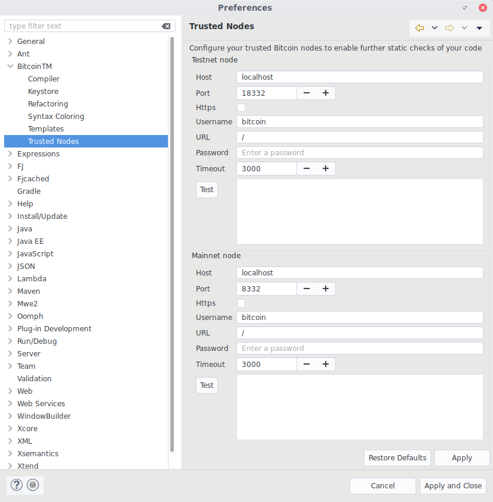
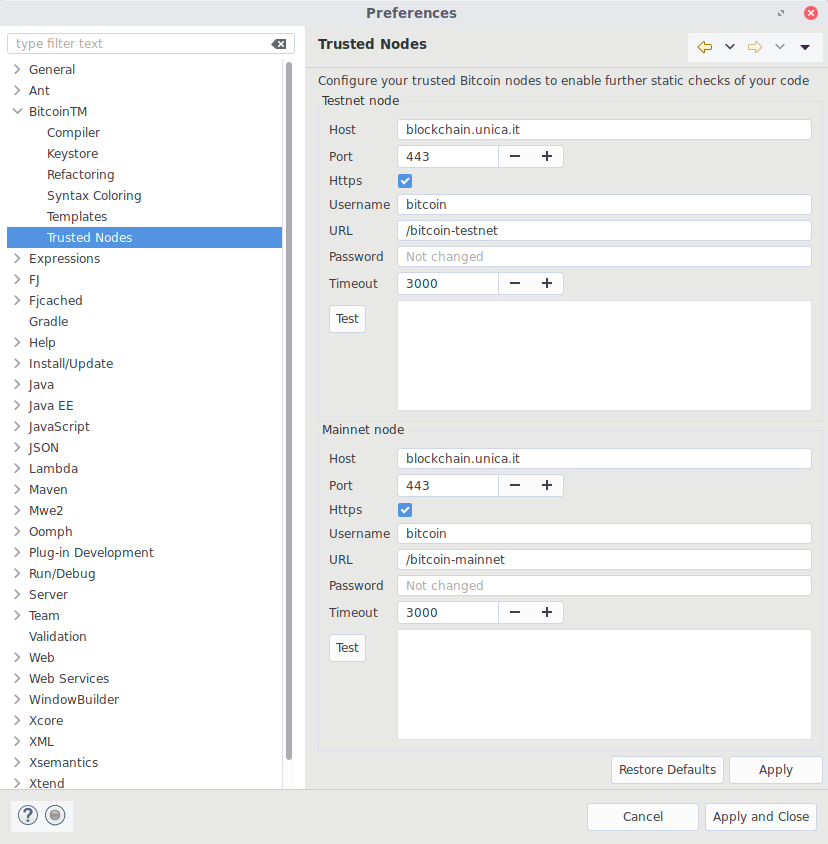

*********************
Eclipse Configuration
*********************

=============
Trusted Nodes
=============

*Trusted nodes* are used to retrieve bitcoin transactions and enable 
expressions like ``const tx = txid:4a5e1e4baab89f3a32518a88c31bc87f618f76673e2cc77ab2127b7afdeda33b``.

Trusted nodes configuration is stored within an Eclipse preferences.
The preference page is accessible through the menu ``Window > Preferences``,
under ``BitcoinTM > Trusted Nodes``.
It allows to configure two *trusted nodes*, one for each network type (testnet/mainnet). 
Default settings connect to a local server with username ``bitcoin`` 
and default port number ``18332`` and ``8332`` respectively for testnet and mainnet.

The parameters are explained below:

:Host: The IP address or domain name of the server (e.g. *localhost* or *blockchain.unica.it*)
:Port: The port number
:Https: Use the HTTP over TLS/SSL protocol.
:URL: The URL path used to contact the server.
:Username: The server username specified via ``--rpcuser`` option. 
:Password: The server password specified via ``--rpcpassword`` option. 
:Timeout: Request timeout in milliseconds. 

The **Test** button allows to check the configuration. 
The text area will display the text **ok** or a stack trace reporting an error message.

.. Note::
	Password are safely stored within `Eclipse Secure Storage <https://help.eclipse.org/oxygen/index.jsp?topic=%2Forg.eclipse.platform.doc.user%2Freference%2Fref-securestorage-start.htm>`_.

.. Tip::
	If you are going to use a remote node, consider enabling the **Https** option.
	Since bitcoin core does not support HTTPS, you should install an HTTP server 
	(like `Apache httpd <https://httpd.apache.org/>`_, `Nginx <https://www.nginx.com/>`_, etc)
	alongside the bitcoin core server (bitcoind), enable HTTPS connections,
	and configure a reverse proxy to redirect a specific URL to bitcoind. 
	Then, configure the **URL** and **port** accordingly.

	Default trusted nodes configuration. Click on the image to view full size.

	Example of trusted nodes configuration. Click on the image to view full size.

.. Warning::

	In order to work properly, bitcoind should be executed with RPC enabled and
	with option ``txindex``.
	For example:

	.. code-block:: none

		bitcoind 
			-server                   # accept command line and JSON-RPC commands
			-testnet                  # use testnet network 
			-txindex                  # create an index for transactions (required)
			-rpcuser=bitcoin          # RPC user
			-rpcpassword=pa55w0rd     # RPC password
			-rpcallowip=0.0.0.0/0     # allow connections from everyone
			-rpcbind=0.0.0.0          # bind to all interfaces

