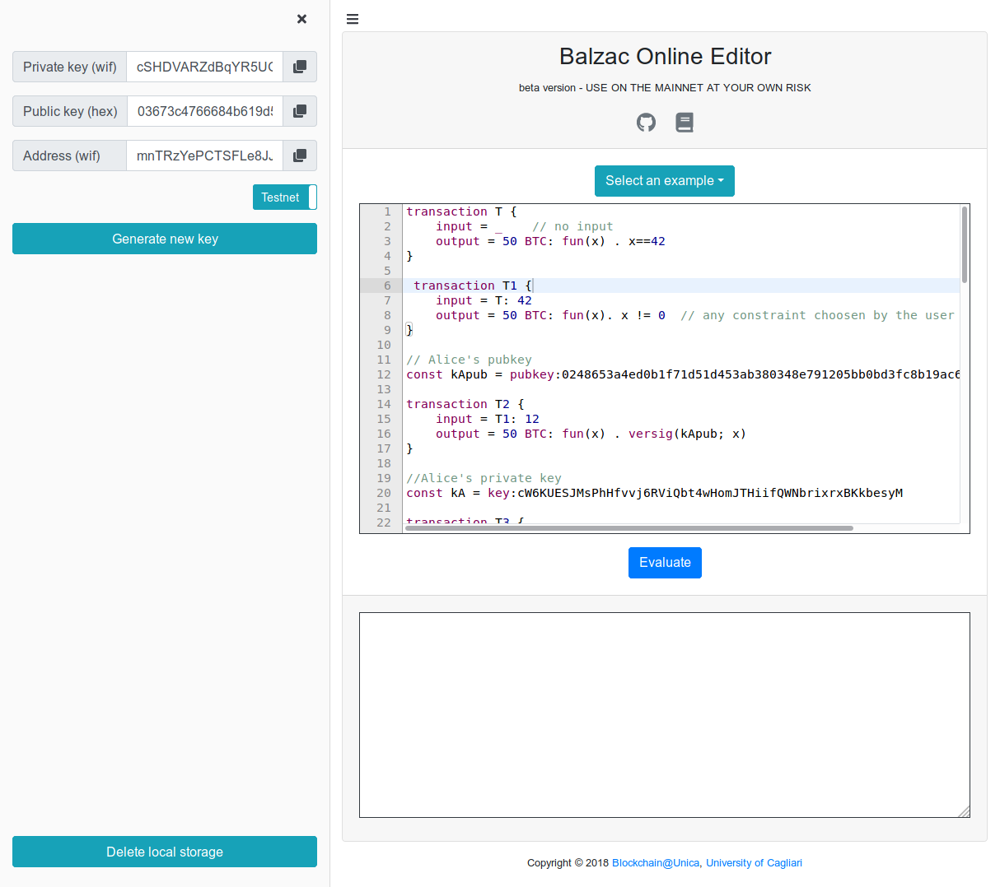

=========================
|langname| in a nutshell
=========================

.. highlight:: btm

|langname| features a simple syntax to express Bitcoin transactions. 
We illustrate  it through a series of examples, that you can experiment with in the `web editor <http://blockchain.unica.it/btm/>`_.

.. _label_t_modeling:

"""""""""""""""""""""
A basic transaction 
"""""""""""""""""""""

Bitcoin transactions transfer currency, the *bitcoins* (BTC).
Each transaction has one or more inputs, from where it takes the bitcoins,  and one or more outputs, which specify the recipient(s).
|langname| also allows for  transactions  with  no inputs:
even thought these transactions cannot be appended *as is* to the actual
Bitcoin blockchain, they are useful to  refer to transactions which are
not know at specification time. 
An example of transaction with no inputs is the following:  

.. code-block:: btm

	transaction T {
		input = _    // no input 
		output = 50 BTC: fun(x) . x==42
	}

The output field of transaction ``T`` contains a value, ``50 BTC``, and 
an *output script*,  ``fun(x) . x==42``.
This means that  50 bitcoins will  be transferred to any transaction
which provides a *witness*  ``x``  such that ``x == 42``.

To append ``T`` to the Bitcoin blockchain,
the placeholder ``_`` for the input must be replaced with the identifier
of an unspent transaction already on the blockchain,
which has at least 50 BTC.  

You can use the `web editor <http://blockchain.unica.it/btm/>`_  to write
|langname| transactions,   to check their syntax, and to compile them  into
actual Bitcoin  transactions.
The output of the compiler is a serialized transaction for the Bitcoin
test network (testnet).
To generate transactions for the main network (mainnet), one must specify the network as follows:  

	.. code-block:: btm
	
		network mainnet  // default is testnet

For instance, let us paste transaction ``T`` into the editor and then let us add command ``compile T`` to it. 
Now, if we hit the button [Compile], the web editor shows in the output box the transaction ``T``  in  Bitcoin (testnet) serialization format.

The serialized transaction can  be sent to the Bitcoin network using the Bitcoin client command ``bitcoin-cli sendrawtransaction``.
Please note, that before sending it, the unspecified input must be substituted
by an actual transaction identifier, as in the following example:

.. code-block:: btm

		//actual Bitcoin transaction identifier 
		const T_ref = txid:<actualBitcoinIdentifier>

		transaction T {
		       input = T_ref: 42
		       output = 50 BTC: fun(x) . x==42
		}

.. Tip ::

	Transaction identifiers have the same format *both in the testnet and
	in the mainnet*. Our tool fetch the transaction body
	by looking into the specified :btm:`network`. 
	A common mistake is to look	for a transaction id into the wrong network.

	Alternatively, you can fetch the body of a transaction on you own and use it as in 
	the following example:

	.. code-block::btm

		const T_ref = tx:0200000001644bbaf06a6318d139fff9a8a1f03c066cafdd0f2b1134ddaf5ffc783bdde01f010000006a473044022012507c618835bdf647ee514424ab0e4b37be1b1f0bffd5b0505150a3b66416b902203fb45f24b5444dfa279ca285f4bdd437b5708e6a2f2cecc27eaf5fdb201d69930121037bb57e56cc43a1260354785f4adf74218ae7f9a71ae24fc4403b54fd5e5420f8ffffffff02a0be2602000000001976a9141e0739c2edcbf5fec56ea29a6ec06192a6f0b23d88ac7423b503000000001976a914478e01a435b4713f6311a8c2e916cf0a58073a0188ac00000000

	Please note the difference between prefixes ``tx:`` and ``txid:``.

.. _label_transaction_redeeming:

"""""""""""""""""""""""""""""""
Redeeming a transaction
"""""""""""""""""""""""""""""""
If one needs to use the bitcoin stored within  ``T``, she  can
redeem it with the following transaction: 

.. code-block:: btm

	transaction T1 {
		input = T: 42
		output = 50 BTC: fun(x). x != 0  // any constraint choosen by the user
	}

Transaction ``T1`` redeems  ``T`` by indicating it  in the  ``input`` field,
and by providing the number 42 as *witness*. 
The value 42 is the actual parameter which  replaces the formal parameter ``x`` in the  output script :code:`fun(x) . x == 42`,  and makes the script evaluate to true.
Any other witness would make the script evaluate to false,
and would prevent the transaction ``T1`` to  be added to the blockchain. 
In Bitcoin, a transaction cannot be spent twice:
hence, once ``T1`` is on the blockchain,
no other transaction having ``T`` as input can be appended.

Note that ``T1`` is redeeming exactly the ``50 BTC`` deposited in ``T``:
in practice, to be able to append ``T1`` to the blockchain,
the value in output of a transaction must be strictly less
than the value in input.
The difference is retained by Bitcoin miners as a fee for their work.
Currently, transactions with zero fee are not likely to be added to the blockchain. 

Now, let us insert both ``T`` and ``T1`` in the editor.  While we
write, the editor performs some static checks and signals the
errors. For instance, if instead of the value ``42`` we provide another
witness for ``T``, (say for instance value ``4``) the editor will
display a warning. If the input field of ``T1`` has a wrong reference
(say ``T3``), or if the total amount of outgoing bitcoin is greater
than the incoming one, the editor will signal the error.

.. _label_t_signature_modeling:

"""""""""""""""""""""""""""""""
Signature verification 
"""""""""""""""""""""""""""""""

The output script of ``T`` is naïve, since anyone can produce the right witness.
Usually, one wants to transfer bitcoins to a specific user.
For instance, the following piece of code makes the 50 BTC in ``T1``
redeemable only by user Alice: 

.. code-block:: btm

	const addrA = address:mvMKu24MRsSDsu6LatViZtx64J6Cxsz3qe // Alice's address

	transaction T1 {
		input = T: 42
		output = 50 BTC: fun(x) . versig(addrA; x)
	}

The constant ``addrA`` declares Alice's *address*:
basically, it is the hash of Alice's public key.
The address is prefixed by the keyword ``address:``,
which means that it is represented in the
:doc:`Wallet Import Format types <types>` [#f1]_.
Note that users may generate as many addresses as they want.

The :ref:`predicate <label_c_functions>` ``versig(addrA; x)``
in the output field of ``T1`` 
evaluates to true if ``x`` is a valid signature
of the transaction which redeems ``T1``,
done with Alice's private key. 

The transaction ``T1`` can be redeemed by a transaction ``T2`` made as follows:

.. code-block:: btm

	const skA = key:cMpBA2wEGKrN1vpxSBzWWzFBwnrypR4rBev4vTbEDPHMeSMyyyMi // Alice's private key

	transaction T2 {
		input = T1: sig(skA)
		output = 50 BTC: ... // any condition chosen by Alice
	}

The witness ``sig(skA)`` is the :ref:`signature <label_c_functions>`
of transaction ``T2`` (without considering the witness itself)
using the private key ``skA``.

To perform examples with Bitcoin,
one can use the online form on the sidebar to generate new addresses and keys.

.. _label_t1_modeling:

"""""""""""""""""""""""""""""""
Multiple inputs and outputs
"""""""""""""""""""""""""""""""
Transactions can have more than one output, in order to split the money on different recipients. 
For instance, we might modify transaction ``T2`` to send some of the total bitcoins to  another address,  still under our control,  like this:

.. code-block:: btm

	const myAddress = address:mvMKu24MRsSDsu6LatViZtx64J6Cxsz3qe
	const mySecondAddress = address:n3A4KGgZD9bW6k2pPccN4rUfX3CgYCPERb

	transaction T1 {
		input = T: 42
		output = [
                         40 BTC: fun(x) . versig(myAddress; x);
                         10 BTC: fun(x) . versig(mySecondAddress; x)
			]
	}	

In this transaction, the output field has two items, which can be redeemed separately. 

Transactions can have more that one input, in case they need to gather money from several sources.
For each input, the transaction must provide a suitable witness. In case inputs refers to a transaction with multiple outputs, their outputs are numbered starting from 0. 
For instance:

.. code-block:: btm
        
	const myAddress = address:mvMKu24MRsSDsu6LatViZtx64J6Cxsz3qe
	const myPrivate = key:cMpBA2wEGKrN1vpxSBzWWzFBwnrypR4rBev4vTbEDPHMeSMyyyMi
	const mySecondPrivate= key:cNzPt3Wad4ymq15AZ2omAmmSv5DBe99pRgsUBCQoeFPeeP57VJkm

	transaction T2 {
		input = [
			T1@0: sig(myPrivate);
			T1@1: sig(mySecondPrivate)
			]
		output = 50 BTC: fun(x) . versig(myAddress; x)
                      
	}	   

where the witness is build up using system function ``sig(k)``, which calculate  the signature of  transaction ``T2`` using the private key ``k``.   (see :ref:`function list <label_c_functions>` ). 

.. rubric:: References

.. [#f1] https://bitcoin.org/en/glossary/wallet-import-format

