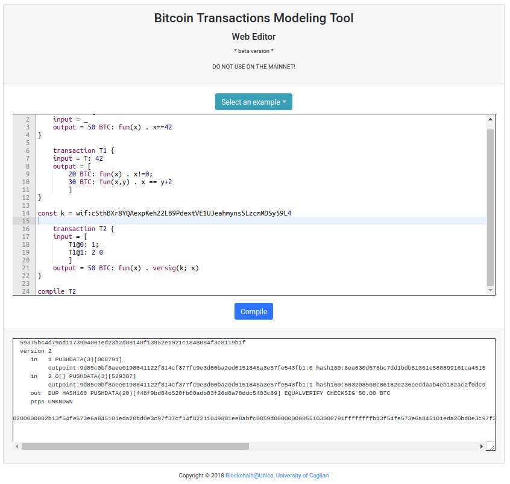

======================
Modeling transactions
======================

.. highlight:: btm

|langname| provides a simple syntax to express Bitcoin transactions. 
You can try the code of this example in the `web editor <http://blockchain.unica.it/btm/>`_.
Let's break it down the syntax through a series of examples. 
The following is an example of a coinbase transaction.

.. code-block:: btm

	transaction T {
		input = _
		output = 50 BTC: fun(x) . x==42
	}

Since ``T`` is a coinbase, it generates new bitcoins. As a consequence, its input field is empty (denoted by ``_``).
The transaction has an output of ``50 BTC``, and its script specifies that it can be redeemed by
whoever can provide a value equal to 42 (so, anyone).

Now we will take advantage of our advanced knowledge of transactions and redeem ``T``.
To do so, we create ``T1`` as follows.

.. code-block:: btm

	transaction T1 {
		input = T: 42
		output = [
			20 BTC: fun(x) . x!=0;
			30 BTC: fun(x,y) . x == y+2
			]
	}

``T1`` redeems ``T``, providing 42 as witness. The witness is evaluated against the script in the output of ``T``,
i.e. :code:`fun(x) . x==42`. But, differently from the previous example, the transaction splits the bitcoins
it redeems between two outputs. The first contains 20 BTC and can be redeemed whit a witness different from 0,
while the other contains 30 BTC and can be redeemed solving a simple equation.

This time we want to redeem our bitcoins and secure them in a transaction that can be spent only by us. 

.. code-block:: btm

	const k = wif:cSthBXr8YQAexpKeh22LB9PdextVE1UJeahmyns5LzcmMDSy59L4

	transaction T2 {
		input = [
			T1@0: 1;
			T1@1: 2 0
			]
		output = 50 BTC: fun(x) . versig(k; x)
	}

Now that we are redeeming ``T1``, a transaction with multiple input, we have to specify which output we want to redeem.
In this case ``T2`` the fist and the second output of ``T1``, i.e. ``T1@1`` and ``T1@2`` respectively. 
The output of ``T2`` requires the parameter ``x`` to be a signature that matches the key ``k``.
The key is declared at line 1, and it is prefixed by the keyword ``wif:`` to denote that it is expressed in the Wallet Import Format [#f1]_.
In this way, the output can only be redeemed by the owner of the key.

To send ``T2`` to the Bitcoin network, we can compile it using the statement ``compile T2``.

After hitting the button Compile, the web editor shows in the output box the compilation details and ``T2`` in Bitcoin serialization format.
The serialized transaction can be send to the network using ``bitcoin-cli sendrawtransaction``.

Bitcoin offers the flexibility to express more complex scripts than simply verifying a signature, as you can see at :doc:`expressions`.
This features can be exploited to design smart contracts, i.e. cryptographic protocols that can handle transfers of bitcoins.
You can see a series of example, e.g. :doc:`timed-commitment`.

.. rubric:: Footnotes

.. [#f1] https://bitcoin.org/en/developer-guide#wallet-import-format-wif 

